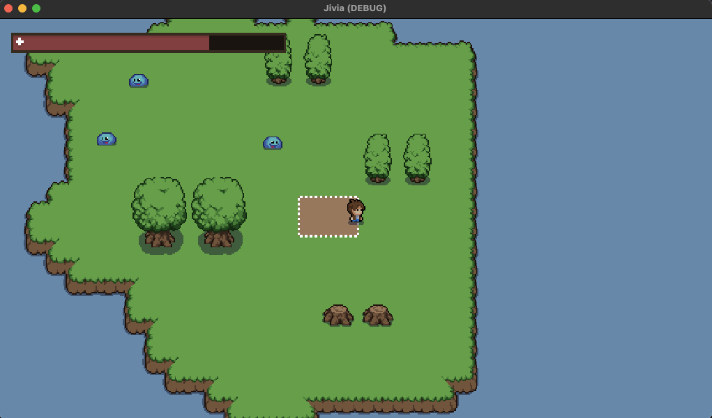

# Jivia

Jivia is a action RPG created to learn game development.

This project uses Godot Engine.

## Screenshot

## Features

- [x] Avoid obstacles (collision)
- [x] Animation on walk/idle
- [x] Attack with animation
- [x] Player & monster stats
- [x] Monsters tries to reach the player
- [x] Monsters attacks
- [x] Player dies
- [x] UI bars
- [ ] Monsters wander around when player's near
- [ ] A-Star algorithm when monsters trying to reach the player
- [ ] A cool map
- [ ] Animation on attack
- [ ] Stats bars on monsters
- [ ] Ranged monsters and weapons